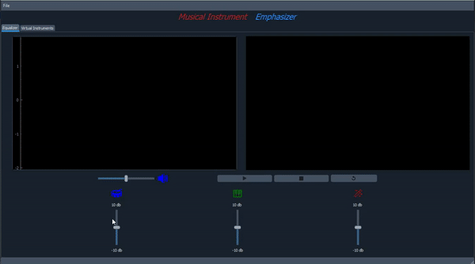

# Musical-Instrument-Equalizer

- [Musical-Instrument-Equalizer](#musical-instrument-equalizer)
  - [Features](#features)
  - [Equalizer & Virtual Instruments Demo](#equalizer--virtual-instruments-demo)
  - [Run-App](#run-app)

## Features
- Opening wav music file, and play/pause.
- Control music volume.
- Showing spectrogram while running the signal.
- Reduce/null/increase the contribution of three instruments in the song or music file(piano, piccolo, snare).

## Equalizer & Virtual Instruments Demo

